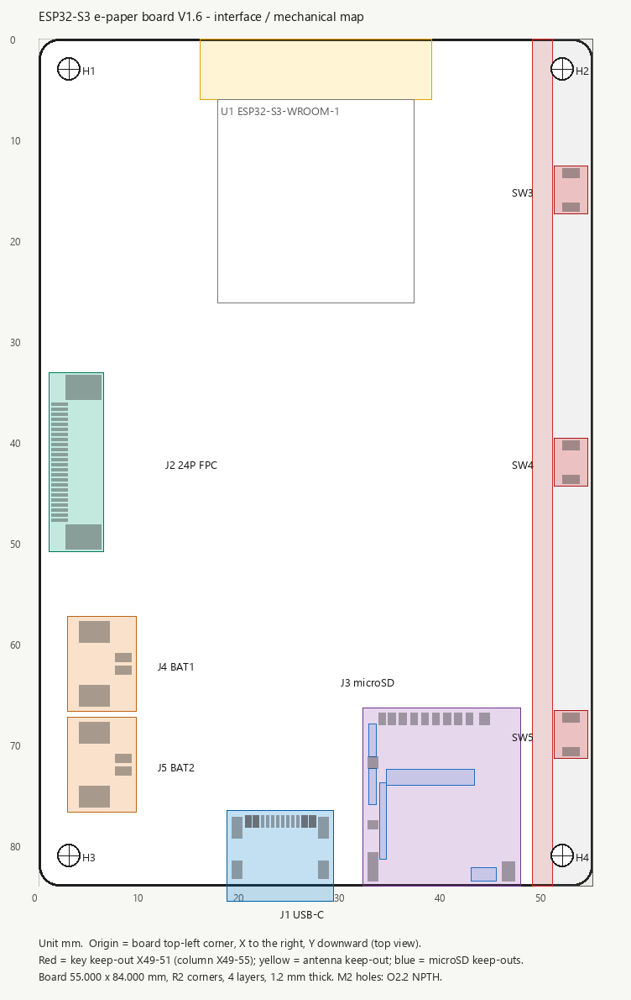

# ESP32-S3 墨水屏主板 — PCB 外框、接口位置与功能需求说明

> **数据来源**：`esp32-board-v1.1.kicad_pcb`（Rev V1.6，2026-09-20 最终 DRC / DFM 版本，
> 与 `esp32-board-v1.1_final_drc_20260920.kicad_pcb` 内容一致）。
> 坐标经过 **F.Cu Gerber 焊盘 flash + KiCad 矢量渲染（SVG）双重核对**，
> 生成脚本：`tools/mech_report.py`（坐标报告）、`tools/mech_map.py`（位置图）。
> 位置图：

---

## 1. 坐标系与单位

| 项 | 说明 |
|---|---|
| 单位 | 全部为 **毫米（mm）** |
| 原点 | **板框左上角**（板框包围盒 (0, 0)） |
| 轴向 | **X 向右、Y 向下**（顶层 F.Cu 俯视，与 KiCad 板编辑器中一致） |
| 深度 | Z 向为板厚方向，板上器件在顶层（F.Cu） |
| 尺寸定义 | 「锚点」= 封装原点；「占地范围」= 封装 courtyard 外框（无 courtyard 时用焊盘外框） |

---

## 2. 板框尺寸与叠层

| 项 | 数值 |
|---|---|
| 外形尺寸 | **55.000 mm (X) × 84.000 mm (Y)**，竖版 |
| 板框包围盒 | X 0.000 – 55.000，Y 0.000 – 84.000 |
| 四角圆角 | **R2.000 mm**（四角各一段 90° 圆弧） |
| 板厚 | **1.2 mm** |
| 层数 | **4 层**：L1 F.Cu / L2 In1.Cu（完整 GND）/ L3 In2.Cu / L4 B.Cu |
| 铜到板边 | ≥ 0.300 mm |
| 最小线宽 / 间距 / 过孔 | 0.150 mm / 0.150 mm / 0.400–0.200 mm |
| 表面处理 | 未指定（Gerber 已导出，见 `fab/20260920/`） |

> 板框只有 8 条直线 + 4 段 R2 圆弧，**没有异形缺口、没有侧边开槽**；
> 全部连接器均为贴装/插件在板内，唯一越过板边的部分是 USB-C 与 microSD 卡座（见第 4 节）。

---

## 3. 四角 M2 安装孔

| 位号 | 板面坐标 (X, Y) | 孔径 | 类型 | 距两边 |
|---|---|---|---|---|
| **H1** | (3.000, 3.000) | Ø2.2 mm | NPTH（无环） | 上边 3.000 / 左边 3.000 |
| **H2** | (52.000, 3.000) | Ø2.2 mm | NPTH（无环） | 上边 3.000 / 右边 3.000 |
| **H3** | (3.000, 81.000) | Ø2.2 mm | NPTH（无环） | 下边 3.000 / 左边 3.000 |
| **H4** | (52.000, 81.000) | Ø2.2 mm | NPTH（无环） | 下边 3.000 / 右边 3.000 |

* 孔间距：**X 方向 49.000 mm**，**Y 方向 78.000 mm**；四个孔为规则矩形排布。
* 封装：`MountingHole:MountingHole_2.2mm_M2`，孔径 Ø2.2 mm 对应 **M2 螺钉**（无金属化环）。
* **装配约束**：板框 `Dwgs.User` 层明确标注 `MOUNTING HOLES: NYLON / PLASTIC POST ONLY`、
  `NO METAL IN ANTENNA AREA` —— 四角固定点按结构评审结论使用 **尼龙/塑料柱**，
  不得在顶部天线区引入金属件。
* 顶部两孔（H1/H2）的封装 courtyard 会伸入右侧按钮禁放区（X 49–51），
  规则文件 `esp32-board-v1.1.kicad_dru` 中 H1–H4 已被显式豁免。

---

## 4. 受约束接口 / 按键位置总表

| 项目 | 位号 | 器件规格 | 锚点 (X, Y) | 旋转 | 占地范围 X | 占地范围 Y |
|---|---|---|---|---|---|---|
| USB-C 插座 | **J1** | GCT `USB4105-GF-A-120`，USB-C 2.0 16P 卧式贴装 | (24.000, 81.330) | 0° | 18.680 – 29.320 | 76.570 – 85.510 |
| 墨水屏 24P FPC | **J2** | XKB X05B20U24T，0.5 mm 上接点抽屉锁 | (3.275, 42.000) | 90° | 1.050 – 6.450 | 33.150 – 50.850 |
| microSD 卡座 | **J3** | Hirose DM3AT-SF-PEJM5，推入式 | (40.000, 75.200) | 0° | 32.180 – 47.880 | 66.380 – 84.080 |
| 电池 1 | **J4** | Molex PicoBlade 53261-0271，2P / 1.25 mm 卧式 | (6.000, 62.000) | −90°（270°） | 2.900 – 9.700 | 57.270 – 66.730 |
| 电池 2 | **J5** | Molex PicoBlade 53261-0271，2P / 1.25 mm 卧式 | (6.000, 72.000) | −90°（270°） | 2.900 – 9.700 | 67.270 – 76.730 |
| 按键 1 | **SW3** | Omron B3U-1000P，顶部按压 | (52.850, 15.000) | 90° | 51.200 – 54.500 | 12.600 – 17.400 |
| 按键 2 | **SW4** | Omron B3U-1000P，顶部按压 | (52.850, 42.000) | 90° | 51.200 – 54.500 | 39.600 – 44.400 |
| 按键 3 | **SW5** | Omron B3U-1000P，顶部按压 | (52.850, 69.000) | 90° | 51.200 – 54.500 | 66.600 – 71.400 |

**SW3/SW4/SW5 中心距 = 27.000 mm**（15.000 → 42.000 → 69.000），
三颗按键锚点 X 完全相同（52.850），在板右侧形成一条垂直列。

> **v2.0 实装提示**：本表是 **v1.1 参考基线**。v2.0 板实测中，
> J1 的整列焊盘/孔沿板内方向平移 **0.356 mm**、J4/J5 的引脚列沿左平移 **0.950 mm**、
> J3 焊盘行向板边偏 **0.175 mm**（SW3–SW5 与 J2 一致）。
> 这四处已按“接受现状”确认，**外壳与结构件请以 §5.6 的实测坐标为准**。

---

## 5. 逐项详细位置

> 本节 5.1 – 5.5 记录 **v1.1 参考基线**（外壳最初按此设计）；
> **v2.0 实装（实测）坐标见 §5.6**，两者差异已在 §5.6 逐项列出。

### 5.1 USB-C 插座 J1

| 项 | 数值 |
|---|---|
| 器件 | GCT `USB4105-GF-A-120`（USB-C 2.0 Sink，16P，卧式顶部安装；早期文档写的 `USB4105-15-A-120` 是同一 USB4105 系列的另一种料号写法，焊盘与本体尺寸相同，本版按 GF 料号采购） |
| 锚点 | (24.000, 81.330)，旋转 0° |
| 信号焊盘行 | **中心 Y = 77.650**，X 20.800 – 27.200（16P：A1–A12 / B1–B12，焊盘 0.60 × 1.15 与 0.30 × 1.15） |
| 焊盘总范围 | X 19.180 – 28.820，Y 77.075 – 83.305（含屏蔽固定孔） |
| 连接器本体（F.Fab） | X 19.530 – 28.470（宽 8.940），Y 77.655 – 85.005 |
| 封装外框（courtyard） | X 18.680 – 29.320（宽 10.640），Y 76.570 – 85.510 |
| **越过板边** | 本体前方超出下边缘 (Y = 84.000) **+1.005 mm**（插口面朝 +Y，朝板外） |
| 位置特点 | 中心 X = 24.000，**比板中线 (27.500) 左偏 3.500 mm**；插口方向 +Y |
| 插件孔 | 4 × 屏蔽固定孔（椭圆 PTH）：(19.680, 78.225) / (28.320, 78.225) 1.00 × 2.10、钻孔 0.6 × 1.7；(19.680, 82.405) / (28.320, 82.405) 1.00 × 1.80、钻孔 0.6 × 1.4 |
| 定位柱孔 | 2 × Ø0.65 mm NPTH：(21.110, 78.725)、(26.890, 78.725)，间距 5.780 mm |

**机械含义**：插头从板下边缘外侧（+Y 方向）插入；外壳开孔需要按 **X = 24.000、板下边缘外
≈1.0 mm** 定位，并给屏蔽壳留出 18.680 – 29.320 的宽度。

---

### 5.2 墨水屏 24P FPC 连接器 J2

| 项 | 数值 |
|---|---|
| 器件 | XKB `X05B20U24T`：24P / 0.5 mm 间距 / **上接点** / 抽屉式锁扣 / H ≈ 2.0 mm |
| 锚点 | (3.275, 42.000)，旋转 90°（开口朝板左边缘 −X） |
| 24 个信号焊盘 | **列中心 X = 2.100**；Y 36.250（Pin24）→ 47.750（Pin1），间距 0.500 mm；单焊盘 1.600 × 0.300 mm |
| Pin1 位置 | **(2.100, 47.750)** |
| Pin24 位置 | **(2.100, 36.250)** |
| 固定焊盘（25/26） | (4.450, 34.600)、(4.450, 49.400)，单焊盘 3.500 × 2.400 mm（在信号焊盘列后方 2.350 mm） |
| 连接器本体（F.Fab） | X 2.550 – 6.350，Y 33.200 – 50.800 |
| 封装外框（courtyard） | X 1.050 – 6.450，Y 33.150 – 50.850（距左边缘 1.050 mm） |

**机械含义**：FPC 从 **板左边缘（−X）水平插入**，排线插入端厚度 0.30 ± 0.03 mm；
连接器整体贴在左边缘内侧，左边缘中段（Y 33 – 51）不得再放置其他器件。

---

### 5.3 双电池接口 J4 / J5

| 项 | J4（BAT1） | J5（BAT2） |
|---|---|---|
| 器件 | Molex `53261-0271`（PicoBlade，2P，1.25 mm，卧式 SMT） | 同左 |
| 锚点 / 旋转 | (6.000, 62.000) / 270° | (6.000, 72.000) / 270° |
| Pin 1（BATx_RAW，正极） | (8.400, 61.375) | (8.400, 71.375) |
| Pin 2（GND） | (8.400, 62.625) | (8.400, 72.625) |
| 固定焊盘（2×） | (5.500, 58.825)、(5.500, 65.175) | (5.500, 68.825)、(5.500, 75.175) |
| 连接器本体（F.Fab） | X 3.400 – 7.600，Y 58.175 – 65.825 | X 3.400 – 7.600，Y 68.175 – 75.825 |
| 封装外框（courtyard） | X 2.900 – 9.700，Y 57.270 – 66.730 | X 2.900 – 9.700，Y 67.270 – 76.730 |
| **插接方向** | 开口朝 **+X（板内方向）**，插头自板内一侧插入 | 同左 |

**说明**

* J4 与 J5 在板左侧上下排列，中心距 **10.000 mm**，引脚在同一列（X = 8.400）。
* 两只连接器各自经一颗 2 A PTC（F2 / F3）汇到公共 `BAT_BUS`；
  **单电池、双电池（并联）均可工作**，板上不做电池均衡。
* 配套胶壳 51021-0200 / 端子 50079-8001 / 26 AWG；默认充电电流 ICHG ≈ 896 mA。
* 两个连接器周围的 courtyard 到板左边界的净空：左边缘侧 X 2.900（即距板边 2.900 mm）。

---

### 5.4 右侧 3 个轻触开关 SW3 / SW4 / SW5

| 项 | 数值 |
|---|---|
| 器件 | **Omron B3U-1000P**（3.0 × 2.5 × 1.6 mm，**顶部按压型 Top-actuated**） |
| 锚点 | (52.850, 15.000) / (52.850, 42.000) / (52.850, 69.000)，旋转 90° |
| 焊盘 | 每颗 2 个：Y = 锚点 Y ∓ 1.700（即 13.300 / 16.700 等），单焊盘 1.700 × 0.900 mm |
| 本体（F.Fab） | X 51.600 – 54.100（宽 2.500），Y = 锚点 Y ± 1.500 |
| 封装外框（courtyard） | X 51.200 – 54.500，Y = 锚点 Y ± 2.400 |
| 按键中心距 | **27.000 mm**（Y 15 / 42 / 69） |
| 距右边缘 | 按键中心距右边 55.000 − 52.850 = **2.150 mm** |
| 按压方向 | **垂直于板面（+Z）**：外壳按键柱从 PCB 正面垂直压下；90° 摆放只改变焊盘/丝印方向 |

**功能对应**：SW3 = KEY1、SW4 = KEY2、SW5 = KEY3（`KEY1_N` / `KEY2_N` / `KEY3_N`，
各自 10 kΩ 上拉到 3V3_MAIN，低电平有效）。

---

### 5.5 microSD / TF 卡座 J3

| 项 | 数值 |
|---|---|
| 器件 | Hirose `DM3AT-SF-PEJM5`（microSD，卧式，推入式） |
| 锚点 | (40.000, 75.200)，旋转 0° |
| 焊盘列（Pads 1–9） | 全部在 **Y = 67.475**，间距 1.100 mm（末位 0.950 mm）：Pin9 (34.125) / Pin8 (35.075) / Pin7 (36.175) / Pin6 (37.275) / Pin5 (38.375) / Pin4 (39.475) / Pin3 (40.575) / Pin2 (41.675) / **Pin1 (42.775)**，单焊盘 0.700 × 1.200 mm |
| Pin9 = 卡检测 | (34.125, 67.475)，网络 `TF_CD_N`（10 kΩ 上拉，低电平 = 插卡） |
| Pin10 | (33.175, 77.975)，1.000 × 0.800 mm，接 GND |
| SH 固定焊盘 | (33.175, 71.775) 1.0 × 1.2；(33.175, 82.125) 1.0 × 2.8；(44.325, 67.475) 1.0 × 1.2；(46.675, 82.575) 1.3 × 1.9（均接 GND） |
| 固定焊盘 | (33.175, 71.775)、(33.175, 82.125)、(44.325, 67.475)、(46.675, 82.575) |
| 卡座本体（F.Fab） | X 33.075 – 46.925（宽 13.850），Y 67.375 – 83.325（深 15.950） |
| 封装外框（courtyard） | X 32.180 – 47.880（宽 15.700），Y 66.380 – 84.080 |
| **插卡方向** | 自 **板下边缘（Y = 84）** 沿 −Y 方向推入 |
| **插拔包络** | 厂商 fab 图给出的插卡/拔卡包络：X 31.000 – 49.000，**Y 62.450 – 87.950**，即超出板下边缘约 **3.950 mm**（含卡片本体的插卡区域到 Y ≈ 88.925，超出约 4.925 mm） |

**microSD 引脚分配（SPI 模式）**：1 = NC，2 = `TF_CS_N`，3 = `TF_MOSI`，4 = 3V3_MAIN，
5 = `TF_SCLK`，6 = GND，7 = `TF_MISO`，8 = NC，9 = `TF_CD_N`，10 = GND，SH = GND。

**机械含义**：卡座位于板右下角，卡座本体完全在板内；但**插卡/拔卡需要板外空间**，
外壳必须在板下边缘外侧预留 ≥ 4 mm（建议按 5 mm）的无阻碍空间，卡口开在外壳下侧。

---

### 5.6 v2.0 实装坐标（实测，2026-09-22 接受）

> **测量基准**：导出板框 Gerber（`Gerber_BoardOutlineLayer.GKO`）实测范围恰为
> X 0.000 – 55.000 / Y 0.000 – 84.000 mm，确认编辑器坐标原点在板左下、Y 向上；
> 换算到本文档坐标（原点板左上、Y 向下）即 `(X, 84 − Y_编辑器)`，并用 H1–H4
> 安装孔实测 (3.000, 3.000) 交叉验证。复现：`python tools/mech_measure.py`、
> `python tools/mech_crosscheck.py`。

| 项 | v1.1 参考（§5.1 – 5.5） | v2.0 实装（实测） | 偏差 |
|---|---|---|---|
| J1 信号焊盘行 中心 Y | 77.650 | **77.294** | −0.356 |
| J1 信号焊盘行 X 范围 | 20.800 – 27.200 | 20.800 – 27.201 | ✓ |
| J1 焊盘 + 屏蔽孔总范围 | X 19.180 – 28.820，Y 77.075 – 83.305 | X 19.177 – 28.822，Y **76.719 – 82.949** | −0.356 |
| J1 屏蔽固定孔（4×） | (19.680, 78.225) 1.00×2.10、(28.320, 78.225)；(19.680, 82.405)、(28.320, 82.405) 1.00×1.80 | (19.680, **77.868**)、(28.321, **77.868**) 1.001×2.101；(19.680, **82.049**)、(28.321, **82.049**) 1.001×1.801 | −0.356 |
| J1 定位柱孔（2× Ø0.65 NPTH） | (21.110, 78.725)、(26.890, 78.725) | (21.110, **78.369**)、(26.890, **78.369**) | −0.356 |
| J1 连接器轮廓（绘制范围） | 本体 F.Fab Y 77.655 – 85.005（外凸 1.005） | Y 76.717 – **84.874**（**外凸 0.874**） | −0.131 |
| J1 锚点（CAD 原点） | (24.000, 81.330) | (24.000, **79.672**) —— v2.0 封装的原点约定与 KiCad 版不同 | — |
| J2 焊盘列 X / Pin1 Y / Pin24 Y | 2.100 / 47.750 / 36.250 | 2.101 / 47.777 / 36.276 | ≤ +0.027 ✓ |
| J2 固定焊盘 / 锚点 | (4.450, 34.600)、(4.450, 49.400) 尺寸 3.50×2.40 / (3.275, 42.000) | 位置同左，尺寸 **3.30×2.30**（v2.0 封装画的略小） / (3.275, 42.000) | 位置 ✓ / 尺寸 −0.20、−0.10 |
| J3 焊盘行 Y | 67.475 | **67.650** | +0.175 |
| J3 焊盘 1–9 的 X（Pin1 → Pin9） | 42.775 / 41.675 / 40.575 / 39.475 / 38.375 / 37.275 / 36.175 / 35.075 / 34.125 | 42.850 / 41.750 / 40.650 / 39.550 / 38.451 / 37.351 / 36.251 / 35.151 / 34.201 | ≈ +0.076 |
| J3 Pin10 / SH 焊盘 | (33.175, 77.975) 1.0×0.8；(33.175, 71.775) 1.0×1.2；(33.175, 82.125) 1.0×2.8；(44.325, 67.475) 1.0×1.2；(46.675, 82.575) 1.3×1.9 | (33.251, 78.150)；(33.251, 71.950)；(33.251, 82.301)；(44.399, 67.650)；(46.749, 82.750) | +0.075 ~ +0.175 |
| J3 锚点 / 轮廓 Y | (40.000, 75.200) / 67.375 – 83.325 | (40.000, 75.200) / **67.050 – 84.033** | 0 / −0.325、+0.708 |
| J4 / J5 Pin1、Pin2 的 X | 8.400 | **7.450** | −0.950 |
| J4 / J5 Pin1 的 Y | 61.375 / 71.375 | 61.374 / 71.374 | ✓ |
| J4 / J5 固定焊盘（2×） | (5.500, 58.825)、(5.500, 65.175)；(5.500, 68.825)、(5.500, 75.175) | (**4.549**, 58.826)、(**4.549**, 65.176)；(**4.549**, 68.826)、(**4.549**, 75.176) | −0.951 |
| J4 / J5 轮廓（绘制范围） | courtyard X 2.900 – 9.700 | X **2.313 – 8.250**（左侧净空 1.950，参考 2.900） | −0.587 / −1.450 |
| J4 / J5 锚点 | (6.000, 62.000) / (6.000, 72.000) | 同左 | ✓ |
| SW3 / SW4 / SW5 焊盘 | Y 13.300/16.700、40.300/43.700、67.300/70.700；X 52.850 | 13.299/16.700、40.299/43.700、67.299/70.701；52.850 | ✓ |

**结论与使用说明**

* 受约束接口里 **J2（24P FPC）与 SW3–SW5 与 v1.1 参考一致**（≤ 0.03 mm），原机械设计可直接沿用。
* **J1 整列（信号焊盘行 + 4 个屏蔽固定孔 + 2 个 Ø0.65 定位孔）沿板内方向平移 0.356 mm**；
  封装内部几何（焊盘 0.30 / 0.60 × 1.15 mm、屏蔽孔 1.00×1.80 与 1.00×2.10、
  定位孔 Ø0.65 及相互间距 8.64 / 4.18 / 5.780 mm）与参考完全一致，属**整体位移**。
  → USB-C 本体前缘 Y = 84.874（**外凸 0.874 mm**），**外壳开孔按此值放样**。
* **J4 / J5 引脚列 X = 7.450 mm**（参考 8.400 mm）→ 左侧结构净空 1.950 mm（参考 2.900 mm）；
  插接方向（开口朝 +X）与 Y 向位置不变。
* **J3 焊盘行 Y = 67.650 mm**（参考 67.475，向板边 0.175 mm）；卡座仍完全在板内，
  自板下边缘推入的插拔包络不变（板外 ≥ 4 mm）。
* 以上四处为 **v2.0 已接受状态**（2026-09-22），不另行平移；若后续改版要回到 v1.1 基线，
  按“偏差”列反向平移即可。

---

## 6. 禁布区（机械 / 电气放置约束）

| 名称 | 范围 (X, Y) | 禁止内容 | 允许内容 |
|---|---|---|---|
| `KEY_RIGHT_MECH_KEEP_OUT` | X **49.000 – 51.000**，Y **0.000 – 84.000**（全高） | 除 SW3/SW4/SW5、H1–H4 外**禁止摆放任何器件**（`.kicad_dru` 自定义规则） | 走线、过孔、铜皮、焊盘允许 |
| `RIGHT_SWITCH_COLUMN`（Dwgs.User 说明框） | X **49.000 – 55.000**，Y 0.000 – 84.000 | 机械说明用（整条右侧带属于外壳区） | — |
| `ESP32_ANT_KEEP_OUT` | X **16.000 – 39.000**，Y **0.000 – 6.000** | 四层**禁止**走线 / 过孔 / 焊盘 / 铜皮 / **器件** | 无 |
| `J3_SOCKET_KEEP_OUT_1` | X 32.775 – 33.525，Y 67.925 – 71.175 | 走线 / 过孔 / 焊盘 / 铜皮 | 器件 |
| `J3_SOCKET_KEEP_OUT_2` | X 32.775 – 33.525，Y 72.375 – 75.975 | 同上 | 器件 |
| `J3_SOCKET_KEEP_OUT_3` | X 33.875 – 34.575，Y 73.775 – 81.375 | 同上 | 器件 |
| `J3_SOCKET_KEEP_OUT_4` | X 42.925 – 45.475，Y 82.175 – 83.525 | 同上 | 器件 |
| `J3_SOCKET_KEEP_OUT_5` | X 34.575 – 43.275，Y 72.475 – 74.075 | 同上 | 器件 |

**右侧按钮禁放区的含义（复述设计意图）**：板右侧 X 49 – 51 是一条**全高（Y 0 – 84）的阻挡墙**，
该区域属于外壳结构区（按键柱、定位、走线通道）。区域内只允许 **SW3/SW4/SW5 三颗按键**和
**H1–H4 四个定位孔**，其它任何器件（包括电阻、电容、连接器、模块）都不得进入。
X 51 – 55 一侧也只保留三颗按键与两个右侧定位孔。

---

## 7. 功能需求描述

### 7.1 系统组成（功能块）

```
                 +-------------------------------------------+
  USB-C (J1) --> | BQ25895 充电 / NVDC Power Path (U2)       |
   5V/2A 输入    |   I2C 配置 + /INT 中断 + /CHG 状态        |
                 +--------+----------------------+-----------+
                          | BAT_BUS              | SYS
        J4 BAT1 --PTC F2--+                      v
        J5 BAT2 --PTC F3--+            TPS63070 Buck-Boost (U3)
                          |                      | 3V3_MAIN
                 MAX17048 电量计 (U4)             +--> ESP32-S3 (U1)
                          |                      +--> microSD (J3)
                          |                      +--> TPS22918 (U6) --EN--> EPD_3V3
                          v                                             |
                     I2C / ALRT / INT                             墨水屏 24P FPC (J2)
```

### 7.2 主控：ESP32-S3

| 项 | 要求 |
|---|---|
| 模组 | **ESP32-S3-WROOM-1-N16R8**（16 MB Flash + 8 MB PSRAM），2.4 GHz Wi-Fi + BLE |
| 供电 | 3V3_MAIN（TPS63070 输出），模组 3V3 引脚就近去耦（C1 22 µF、C2 10 µF、C3 1 µF、C4 100 nF）；C5 1 µF 是 `RESET_N` 复位电容，不属于 3V3 去耦 |
| 复位 / 烧录 | SW1 = RESET（`RESET_N`）、SW2 = BOOT（`BOOT`，GPIO0） |
| 天线 | 模组天线位于板的**上边缘**，对应上方 X 16 – 39 / Y 0 – 6 的天线禁布区 |
| 调试 | 本版**不设测试点**。所有未使用的 GPIO 均为显式 No Connect：GPIO3 / GPIO35 / GPIO36 / GPIO37 / GPIO38 / GPIO39 / GPIO40 / GPIO41 / GPIO42 / GPIO43（TXD0）/ GPIO44（RXD0）/ GPIO45 / GPIO46 / GPIO48，对应模组脚 15、16、25、26、28–37 |

**GPIO 分配（模组引脚号 ↔ 网络 ↔ GPIO）**

| 模组脚 | GPIO | 网络 | 用途 |
|---:|---|---|---|
| 4 | IO4 | `KEY1_N` | 右侧按键 1（SW3） |
| 5 | IO5 | `KEY2_N` | 右侧按键 2（SW4） |
| 6 | IO6 | `EPD_PWR_EN` | 墨水屏 3V3 负载开关使能（TPS22918） |
| 7 | IO7 | `EPD_BUSY` | 墨水屏忙信号 |
| 8 | IO15 | `KEY3_N` | 右侧按键 3（SW5） |
| 9 | IO16 | `CHG_INT_N` | 充电器 BQ25895 中断 |
| 10 | IO17 | `TYPEC_INT_N` | Type-C 控制器 TUSB320LI 中断 |
| 11 | IO18 | `I2C_SDA` | I2C 数据（BQ25895 / MAX17048 / TUSB320LI） |
| 12 | IO8 | `EPD_RST_N` | 墨水屏复位 |
| 13 | IO19 | `USB_DN` | USB D−（经 22 Ω） |
| 14 | IO20 | `USB_DP` | USB D+（经 22 Ω） |
| 17 | IO9 | `EPD_DC` | 墨水屏 D/C# |
| 18 | IO10 | `EPD_CS_N` | 墨水屏片选 |
| 19 | IO11 | `SPI_MOSI` | SPI MOSI（墨水屏与 TF 共用） |
| 20 | IO12 | `SPI_SCLK` | SPI SCLK（墨水屏与 TF 共用） |
| 21 | IO13 | `SPI_MISO` | SPI MISO（只接 TF 卡；墨水屏无 MISO 脚，经 0 Ω R35 到卡侧 `TF_MISO`） |
| 22 | IO14 | `TF_CS_N` | microSD 片选 |
| 23 | IO21 | `I2C_SCL` | I2C 时钟 |
| 24 | IO47 | `CHG_CE` | BQ25895 /CE（10 kΩ 上拉，默认禁充） |
| 27 | IO0 | `BOOT` | BOOT 按键 / 下载模式 |
| 38 | IO2 | `TF_CD_N` | microSD 卡检测 |
| 39 | IO1 | `FG_ALRT_N` | 电量计 MAX17048 报警 |

### 7.3 墨水屏（10.2 英寸电子纸）

| 项 | 要求 |
|---|---|
| 屏 | Good Display **GDEM102T91**，10.2 英寸 AM EPD，**960 × 640**，SSD1677 驱动 |
| 有效显示区 | 215.52 × 143.68 mm；屏体外形 224 × 157 × 1.0 mm |
| 连接 | **24P / 0.5 mm FPC**，经 J2（上接点、抽屉锁扣）连接；排线插入端 0.30 mm |
| 接口 | SPI 写通道（SCLK / SDA = MOSI / CS#）+ D/C# + RES# + BUSY。**GDEM102T91 的 FPC 没有 MISO / SDO 脚**（Pin1/4/6/7/19 为 NC），`SPI_MISO` 只用于 TF 卡。与 TF 卡共用 SPI 总线、片选独立 |
| 高压 | 板载 Booster：L3 47 µH + Q1（Si1304BDL，SC-70-3）+ D6/D7/D8（MBR0530）+ R30/R31 + C29，产生 VGH / VGL / VSH1 / VSH2 / VSL / VCOM |
| 电源门控 | `EPD_3V3` 由 **TPS22918（U6）** 开关，`EPD_PWR_EN`（GPIO6）控制，100 kΩ 下拉保证默认关断 |
| 布局要求 | 高压电容、电感、开关管构成短环路；EPD 高压节点与低压信号保持间距（Net Class `HV_EPD`） |

### 7.4 USB-C 与输入保护

| 项 | 要求 |
|---|---|
| 接口 | USB-C 2.0 Sink（16P），**与 5 V / 2 A 电源兼容**（高温环境不承诺连续 2 A） |
| CC 逻辑 | TUSB320LI（U5）经 I2C 上报电流能力，`TYPEC_INT_N` 中断到 GPIO17 |
| 保护 | VBUS：F1（2 A PTC，0805）+ D1（5.6 V TVS）；D+ / D−：D2 / D3 ESD；CC1 / CC2：D4 / D5 ESD |
| 数据 | D+/D− 经 22 Ω 串阻（R9 / R10）到模组 GPIO20 / GPIO19；USB 90 Ω 差分（W 0.24 / S 0.18 mm） |

### 7.5 双电池与充电

| 项 | 要求 |
|---|---|
| 电池接口 | **J4（BAT1）+ J5（BAT2）**，Molex PicoBlade 2P / 1.25 mm；单电池或双电池并联都能工作 |
| 输入保护 | 每路各一颗 2 A PTC（F2 / F3）后汇入公共 `BAT_BUS`；0.1 µF（C17）与 10 µF（C12）**放在公共 `BAT_BUS` 侧**，连接器侧（`BAT1_RAW` / `BAT2_RAW`）不另加电容。若后续要做线束/EMI 滤波，再在 `BAT1_RAW` / `BAT2_RAW` 各加 1 颗 100 nF |
| 充电器 | **BQ25895（U2）**，NVDC Power Path，I2C 可编程，开关电感 L1 + PMID/SYS 电容组 |
| 充电电流 | 默认 **ICHG ≈ 896 mA**（14 × 64 mA），由连接器/线束热预算决定；IINLIM / ITERM / VREG 由固件写入 |
| 充电使能 | `/CE = CHG_CE`（GPIO47），**10 kΩ 上拉 → 上电默认禁止充电**；MCU 完成 I2C 配置并回读校验后再拉低使能 |
| 温度 | NTC1（10 kΩ / B25-85 = 3435 K）接 BQ25895 TS，测量的是 **PCB / 电池附近环境温度**，不是电芯内部温度（若需真实电芯温度保护，需 3Pin 电池接口或电池包内置 NTC） |
| 热插拔 | 支持 USB 与电池同时接入；VBUS 路径与电池路径由 BQ25895 自动仲裁 |

### 7.6 充电状态监测

| 项 | 实现 |
|---|---|
| 中断 | BQ25895 `/INT` → `CHG_INT_N` → **GPIO16**（10 kΩ 上拉到 3V3_MAIN）；状态变化/故障时拉低，MCU 唤醒后读寄存器 |
| 状态读取 | I2C（GPIO18 / GPIO21）读 BQ25895 的 `CHRG_STAT`、`PG_STAT`、故障与 NTC 温度状态寄存器 → 判定「未充电 / 预充 / 恒流 / 恒压 / 充满 / 故障」的充电状态 |
| 上电时序 | MCU Boot → I2C 初始化 → 写 ICHG / IINLIM / ITERM / VREG → 回读确认 → `/CE` 拉低使能充电 |
| ⚠️ 现状说明 | BQ25895 的 **`/CHG` 引脚（网络 `CHG_STAT`）本版只做 10 kΩ 上拉，未接入 MCU**，不能直接当硬件状态脚使用；状态监测**必须走 I2C + `/INT`**。若产品要求硬件级状态指示，下一版需把 `CHG_STAT` 引到空闲 GPIO 或加 LED 驱动。 |

### 7.7 电量计

| 项 | 要求 |
|---|---|
| 器件 | **MAX17048G+T10（U4）**，I2C 电量计（ModelGauge） |
| 测量点 | `CELL` 接 **`BAT_BUS`**（并联电池总正极），单点测量整组电池的 SOC / 电压 |
| 报警 | `ALRT` → `FG_ALRT_N` → **GPIO1**（10 kΩ 上拉）；可配置低电量阈值唤醒 MCU |
| 布局 | 紧邻电池入口与 `BAT_BUS` 主干，去耦电容就近 |

### 7.8 电源与存储

| 项 | 要求 |
|---|---|
| 3V3 主电源 | **TPS63070（U3）** Buck-Boost：SYS → 3V3_MAIN；反馈 470 kΩ / 150 kΩ → 3.3 V；L2 1.2 µH（MWSA0402S） |
| 电源网络 | `USB_VBUS_RAW/PROT`、`BAT1_RAW` / `BAT2_RAW`、`BAT_BUS`、`SYS`、`3V3_MAIN`、`EPD_3V3`、`CHG_PMID` |
| 大电流主干 | BAT / SYS / USB_VBUS 主干 0.80 mm；Net Class `POWER` 默认 0.50 mm / 0.20 mm 间距 |
| 存储 | microSD（SPI 模式）：SCLK / MOSI / MISO 与墨水屏共用。**模组与墨水屏侧网络名为 `SPI_SCLK` / `SPI_MOSI` / `SPI_MISO`，卡侧为 `TF_SCLK` / `TF_MOSI` / `TF_MISO`**，两侧经 0 Ω `R33` / `R34` / `R35` 相连；`TF_CS_N`（GPIO14）为独立片选（同一网络直达卡座），`TF_CD_N`（GPIO2）卡检测、10 kΩ 上拉 |

### 7.9 按键功能

| 位号 | 功能 | 网络 | 位置 |
|---|---|---|---|
| SW1 | RESET | `RESET_N` | (22.000, 32.000)（非约束项） |
| SW2 | BOOT / 下载 | `BOOT` | (30.000, 32.000)（非约束项） |
| **SW3** | 用户按键 1 | `KEY1_N`（GPIO4） | **右侧列，(52.850, 15.000)** |
| **SW4** | 用户按键 2 | `KEY2_N`（GPIO5） | **右侧列，(52.850, 42.000)** |
| **SW5** | 用户按键 3 | `KEY3_N`（GPIO15） | **右侧列，(52.850, 69.000)** |

三颗右侧按键均为 **顶部按压**（外壳按键柱垂直压下），10 kΩ 上拉、低电平有效，
间距 27 mm，必须保持在同一垂直列并处于 X 49 – 55 的右侧结构带内。

---

## 8. 位置自由度说明

**受位置约束的只有下列项目**（本文件第 3 – 6 节）：

1. 板框外形（55 × 84 mm、R2 圆角）；
2. 四角 M2 安装孔 H1 – H4；
3. USB-C（J1）及其开孔方向与外凸量；
4. 墨水屏 24P FPC（J2）及其插拔方向；
5. 双电池接口（J4 / J5）及其插接方向；
6. 右侧 3 个轻触开关 SW3 / SW4 / SW5（含右侧按钮禁放区）；
7. microSD 卡座（J3）及其插拔包络；
8. 天线禁布区与卡座禁布区。

**其余元器件不约束位置**：U1（除外形需避让天线禁区）、U2 / U3 / U4 / U5 / U6、
F1 – F3、D1 – D8、L1 – L3、Q1、NTC1、SW1 / SW2 以及全部电阻电容，都可以重新摆放。
重新布局时只需要同时满足：

* 不进入天线禁布区、右侧按钮禁放区、卡座禁布区；
* 不破坏 USB-C / FPC / 电池 / 卡座的机械外廓与插拔方向；
* 电源环路（BQ25895 SW–L1–SYS、TPS63070 L1/L2–L2、EPD Booster 环路）保持短而对称；
* 布线规则（Net Class、0.15 mm 最小间距、USB 90 Ω 差分）不变。

---

## 9. 投板前需要注意的机械/功能事项

| # | 事项 | 现状 / 结论 |
|---:|---|---|
| 1 | USB-C 本体超出板下边缘 **0.874 mm**（v2.0 实装；v1.1 参考为 1.005 mm） | 外壳开孔按 **§5.6 实装坐标**放样，本体前缘 Y = 84.874 |
| 2 | microSD 插拔包络超出板下边缘 **≈ 4 mm（最大 4.925 mm）** | 已确认接受卡座不额外外凸；外壳需在下侧留出插拔空间 |
| 3 | 四角固定方式 | `Dwgs.User` 标注**尼龙/塑料柱**、天线区禁金属 |
| 4 | BQ25895 `/CHG`（`CHG_STAT`）未接 MCU | 状态监测走 I2C + `/INT`（见 7.6）；如需要硬件状态指示需改版 |
| 5 | 双电池并联无均衡电路 | 需使用同型号、同容量、同批次电池；单电池方案同样可用 |
| 6 | 电池连接器/线束温升 | 须实测 J4/J5 峰值电流与温升（Wi-Fi TX + EPD 刷新 + TF 读写并发） |
| 7 | F1 – F3（PTC）高温降额 | 25 / 40 / 50 °C 下分别验证，不承诺高温连续 2 A |
| 8 | 电池连接器 J4 / J5 引脚列在 X = **7.450 mm**（v1.1 参考 8.400 mm） | 已接受（v2.0 实装）；左侧结构净空 1.950 mm，插接方向与 Y 向位置不变，见 §5.6 |
| 9 | microSD 卡座 J3 焊盘行在 Y = **67.650 mm**（v1.1 参考 67.475 mm） | 已接受（v2.0 实装）；卡座本体仍在板内，板外插拔空间按 ≥ 4 mm 预留，见 §5.6 |

---

## 10. 数据核对记录

| 校验项 | 方法 | 结果 |
|---|---|---|
| 板框尺寸 | 解析 `Edge.Cuts`（8 直线 + 4 圆弧） | 55.000 × 84.000 mm，R2.000 |
| 焊盘坐标 | 解析 `.kicad_pcb` 焊盘 + 封装旋转，再与 **F.Cu Gerber flash 坐标**比对（J2 Pin1 = (2.100, 47.750) 等） | 一致 |
| 封装外框 | 解析 `F.CrtYd` / `F.Fab` 图形并施加封装旋转 | 与 KiCad 渲染 SVG、Gerber 一致 |
| 安装孔 | 解析 NPTH 焊盘 | 4 × Ø2.2 mm，坐标见第 3 节 |
| 规则区 | 解析 `.kicad_pcb` zone keepout + `.kicad_dru` 自定义规则 | 见第 6 节 |
| DRC / ERC | `kicad-cli`（2026-09-20 最终版） | ERC 0、DRC 0 Error / 0 Warning / unconnected 0 |

> 复现命令：
> `python tools/mech_report.py <board.kicad_pcb> [J1 J2 ...] [PADS:J1 ...]`
> `python tools/mech_map.py <board.kicad_pcb> render/pcb_interface_map.png`
